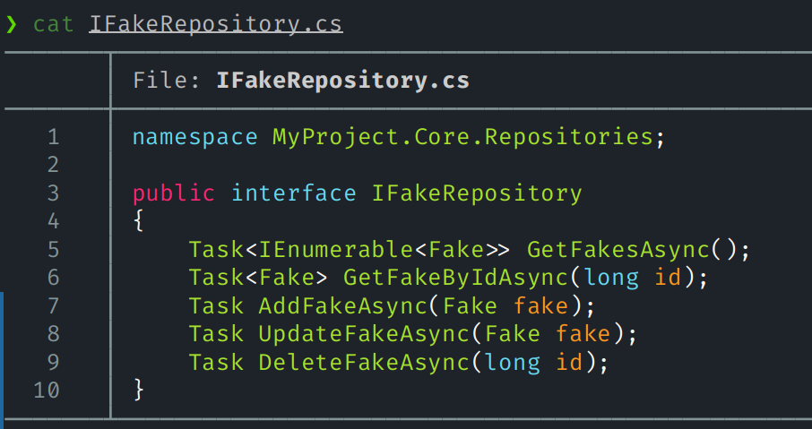
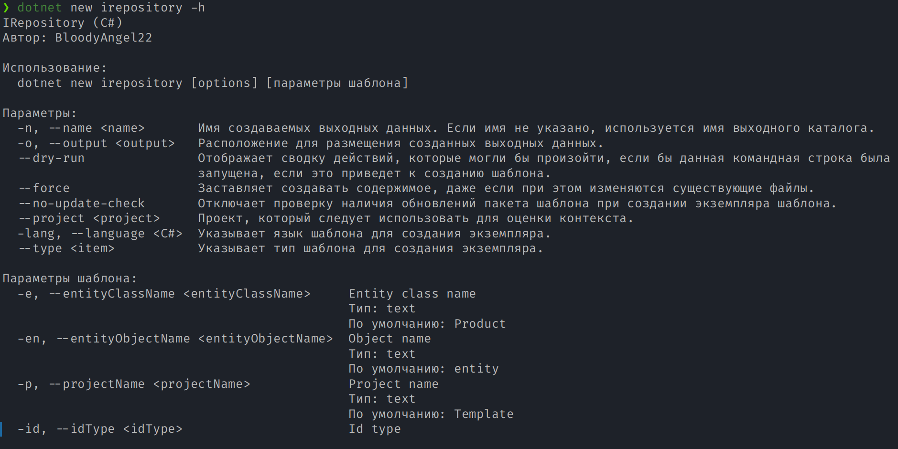

# 🚀 CleanArchItemTemplates for ASP.NET Core

Tired of writing repetitive boilerplate code for repositories, interfaces, services, and basic CRUD operations?  
You're not alone — and this project is here to help.

This collection of `.NET` item templates lets you generate common Clean Architecture components in seconds.  
Whether you're working solo or in a team, these templates will save you time and keep your codebase consistent.

Feel free to **fork the project** and make it your own! 💡

---

## 📦 Included Templates

This package includes multiple item templates designed to help you follow Clean Architecture principles quickly and consistently.
Each template is tailored for a specific layer of your application — from controllers to repositories to helpers.

| Template Name        | Short Name        | Language | Description                                  |
| -------------------- | ----------------- | -------- | -------------------------------------------- |
| **Controller**       | `controller`      | C#       | Generates a basic CRUD controller.           |
| **Fluent Validator** | `fluentvalidator` | C#       | Sets up a FluentValidation validator.        |
| **IRepository**      | `irepository`     | C#       | Interface for a CRUD repository.             |
| **Repository**       | `repository`      | C#       | A concrete repository with basic CRUD.       |
| **Service**          | `service`         | C#       | A basic service layer with CRUD logic.       |

---

## 🛠️ **Installation**

### ✅ Install all templates at once

> ⚠️ This will install **all available templates**. If you only need a specific one, see the next section.

Run this in the root folder of the project:
```bash
dotnet new install ./
```

### 🔄 Update all templates
If you've already installed the templates, update them with:
```bash
dotnet new install ./ --force
```

### 🎯 Install a specific template (e.g., IRepository)
If you only want to install a specific template, like the IRepository:
```bash
dotnet new install ./IRepository
```

### 🔄 Update a specific template
To update just one:
```bash
dotnet new install ./IRepository --force
```

---

## 🚀 Usage Example

Create a new component in your project using the irepository template:
```bash
dotnet new irepository \
  --name IFakeRepository \
  --entityClassName Fake \
  --entityObjectName fake \
  --projectName MyProject \
  --idType long
```

📸 Preview:


You can always look at the parameters passed and find abbreviations for the arguments
```bash
dotnet new irepository -h
```

📸 Preview:


---

🙌 Contribute
This is an open-source project — feedback, ideas, and contributions are welcome!

If you find these templates useful, give the repo a ⭐ and share it with your team!

---

📄 License
MIT License. Do whatever you want, just don’t blame me if your code breaks 😄

---